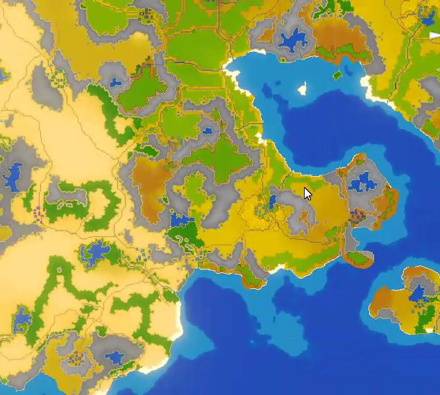
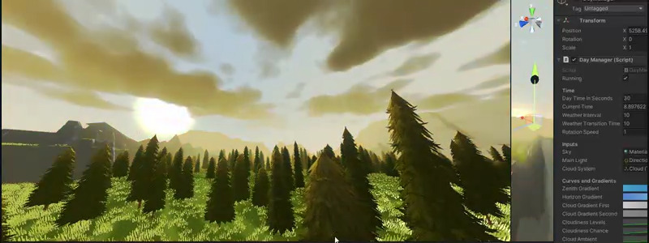
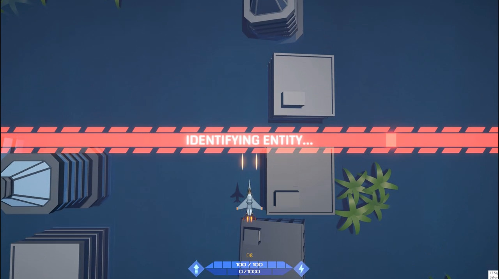

# What am I working on

Currently studying CS, and developing games on Unity when free. Current main unity project is an unannounced FPS game, will include it in the personal projects showcase section later (probably somewhere next spring)

# 💻 Domains I work with:

# 📊 GitHub Stats:
 

<!-- Proudly created with GPRM ( https://gprm.itsvg.in ) -->

# Game tech showcase

## 🕹 Game Tech Showcase

### Map Generator Snapshots
<table>
  <tr>
    <td></td>
    <td></td>
  </tr>
</table>

### Cloud & Moon Shader Work (Smoother available )

### Topdown Bullet Hell Game

### Map Uploading & Sharing Website

