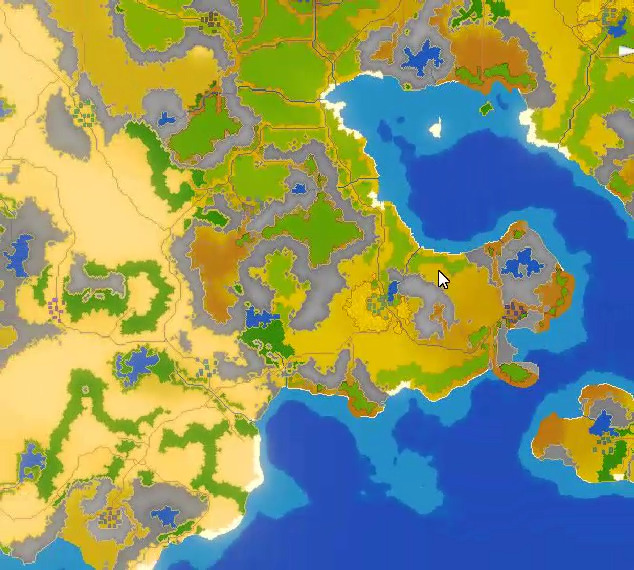
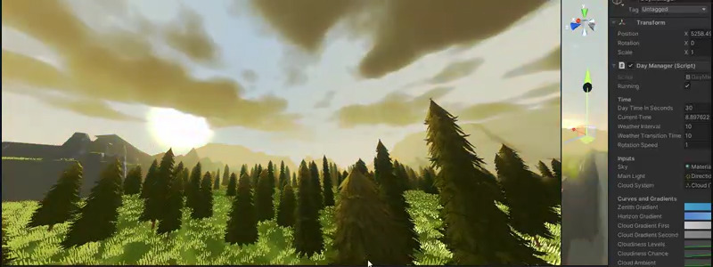
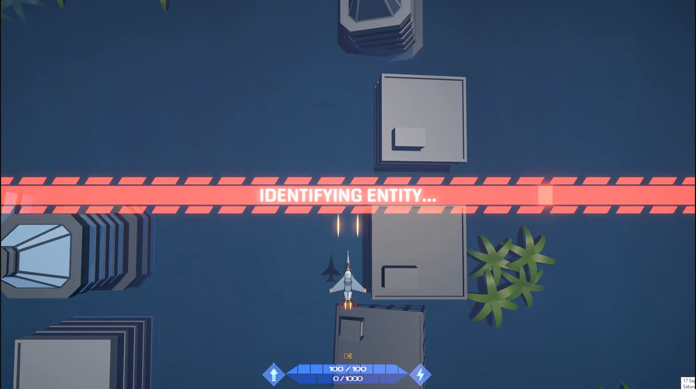

# What am I working on

Currently I am working on a website which will be deployed on Railway, which will be used to manage game maps and markers. For those interested, the tech stack is the following:

| Layer        | Technology                   |
|--------------|------------------------------|
| Framework    | Next.js 15 (App Router)      |
| Language     | TypeScript                   |
| Database     | SQLite (dev) / PostgreSQL (prod) |
| ORM          | Prisma 7                     |
| Auth         | Auth.js v5 (Discord OAuth)   |
| Map          | React Leaflet + Leaflet      |
| Cache        | Redis (optional)             |
| Styling      | Tailwind CSS + Radix UI      |
| Validation   | Zod                          |
| Unit tests   | Vitest                       |
| E2E tests    | Playwright                   |

After this, I will be resuming my work on a game project that was on hold for the time of my studies.

# 💻 Domains I work with:

# 📊 GitHub Stats:
 

<!-- Proudly created with GPRM ( https://gprm.itsvg.in ) -->

# Game tech showcase

## 🕹 Game Tech Showcase

### Map Generator Snapshots
<table>
  <tr>
    <td></td>
    <td></td>
  </tr>
</table>

### Cloud & Moon Shader Work ([Smoother version here](https://i.gyazo.com/27c5a06b47f0ac2483126a447f795985.mp4))

### Topdown Bullet Hell Game

### Map Uploading & Sharing Website ([See example video](https://i.gyazo.com/7474fe431e869beec751af81045cebfc.mp4))

