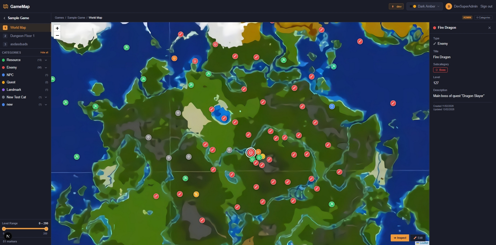
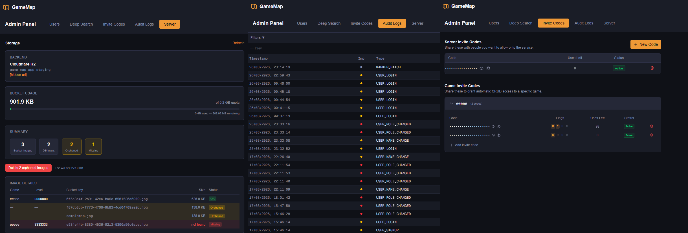
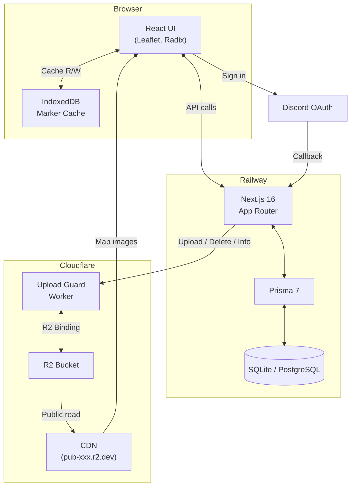

To be deployed later in 2026.

# What is it?

This platform enables users to collaborate on in-game intelligence by uploading custom game maps and placing interactive markers to share information with others. [Video link](https://i.gyazo.com/7474fe431e869beec751af81045cebfc.mp4)

<table>
  <tr>
    <td></td>
    <td></td>
  </tr>
</table>

## Features

- Highly customizable category and subcategory system  
- Advanced filtering for efficient search and navigation  
- Fine-grained ACL-based access control ensuring privacy per game and across the platform  
- Intuitive UX minimizing manual effort for both users and administrators  
- Designed for high scalability using caching (Redis), load balancing, replication, and sharding  
- Discord-based authentication  

## Upcoming

- Single Sign-On (SSO) support  
- Mobile-optimized version
- Additional marker types (Zones & Lines)
- Automated AI-based Admin reports on collected data (Statistics & Logs)

## Tech stack

| Layer           | Technology                                       |
|-----------------|--------------------------------------------------|
| Framework       | Next.js 16 (App Router)                          |
| Language        | TypeScript                                       |
| Database        | SQLite (dev) / PostgreSQL (prod)                 |
| ORM             | Prisma 7                                         |
| Auth            | Auth.js v5 (Discord OAuth)                       |
| Map             | Leaflet (imperative) + leaflet.markercluster     |
| Client cache    | IndexedDB via `idb`                              |
| Styling         | Tailwind CSS v4                                  |
| UI primitives   | Radix UI (dialog, dropdown, select, label)       |
| Validation      | Zod                                              |
| Image processing| sharp                                            |
| Cloud storage   | Cloudflare R2 (S3-compatible)                    |
| Upload gateway  | Cloudflare Worker (upload-guard)                 |
| Deployment      | Railway (staging + production)                   |
| Unit tests      | Vitest                                           |
| E2E tests       | Playwright                                       |

## High-Level Diagram

